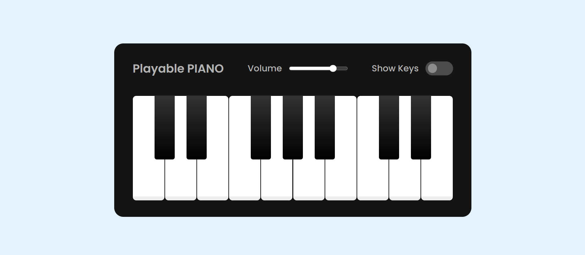

<h1 align='center'>Piano</h1>
If you don’t know, a piano is a musical instrument that produces sound by striking a series of keys or notes on a keyboard. On my piano, users can play various tunes by clicking on the keys or using the keyboard keys. They can also adjust the volume and show or hide shortcut keys on the piano.

<h2>ScreenShots</h2>

